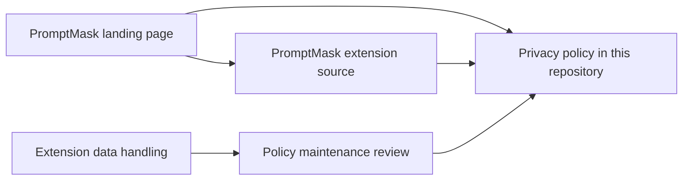

# PromptMask policy

This repository publishes the [PromptMask privacy policy](privacy.html) for Team AER's browser extension. It contains a standalone HTML document; the extension and its model tools live in [Team-AER/PromptMask](https://github.com/Team-AER/PromptMask).

PromptMask masks sensitive details in AI chat composers with a Gemma model running locally through WebGPU. Users choose sites and categories, inspect the redacted preview, and submit again to send it to their chat provider. The [product landing page](https://aer.app/promptmask/) introduces these features, model requirements, and privacy limits; its source lives in [aer-landing/promptmask](https://github.com/Team-AER/aer-landing/tree/main/promptmask).

## Repository relationships



## Read and preview

Open `privacy.html` directly in a browser, or serve this directory locally:

```sh
python3 -m http.server 8000 --bind 127.0.0.1
```

Then visit `http://127.0.0.1:8000/privacy.html`. The document has inline styles and needs no build step, JavaScript, remote fonts, or image assets. This local preview does not publish the policy.

## Maintaining the policy

When extension behavior changes, check these files in the extension repository:

- `extension/offscreen.js`: local inference and diagnostic console output.
- `extension/model_cache.mjs`: model download hosts, browser cache, and progress state.
- `extension/content_script.js`: interception, preview, category settings, and native submission.
- `extension/popup.js` and `extension/manifest.json`: settings controls, permissions, and supported sites.

Update the disclosures and revision date together. Keep the contact address current, check links, and inspect the HTML at desktop and mobile widths before raising a pull request. Local inference does not prevent a chat page from reading its own composer or receiving the message a user submits.

The policy currently documents model downloads, local settings/cache, sensitive text in developer-console logs, and the limits of masking. It describes the extension's implementation; it does not describe the landing page's separate hosting behavior.

## Attribution and contact

PromptMask uses Google's Gemma model through MediaPipe. Gemma is provided under and subject to the [Gemma Terms of Use](https://ai.google.dev/gemma/terms); see also the [Prohibited Use Policy](https://ai.google.dev/gemma/prohibited_use_policy). This repository does not distribute model weights or extension code.

Policy questions: [nidhi@aer.app](mailto:nidhi@aer.app).
